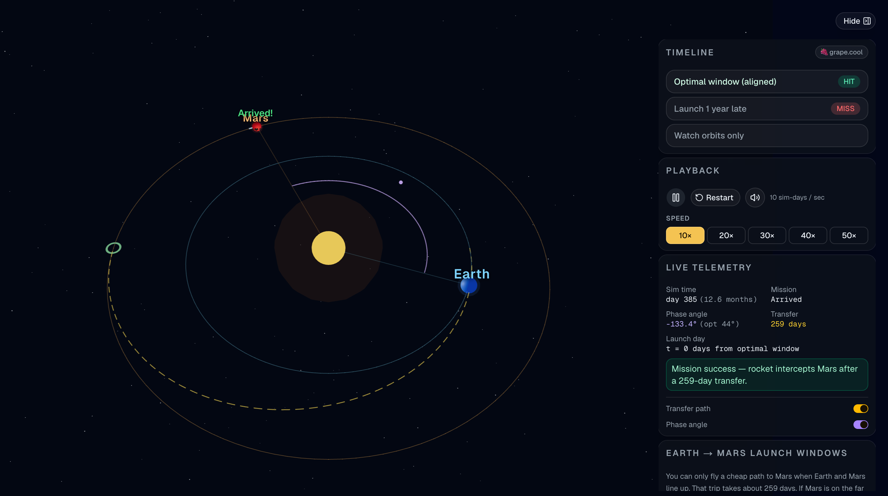

# Earth → Mars Orbit Simulation

Interactive **Next.js + Three.js** lab for Earth–Mars launch windows: why a cheap trip only works when the planets line up, about every two years.

**Live demo:** [https://ozgrozer.github.io/earth-mars-orbit-simulation/](https://ozgrozer.github.io/earth-mars-orbit-simulation/)

[](https://ozgrozer.github.io/earth-mars-orbit-simulation/)

## What you’ll see

| Timeline | What happens |
|----------|----------------|
| **Optimal window** | Planets phased correctly. Starship rides a Hohmann ellipse (~259 days) and meets Mars. |
| **Launch 1 year late** | Same burn, wrong geometry. The ship reaches Mars’s *orbit* but Mars isn’t there. |
| **Watch orbits only** | No launch. Earth (fast, inner) and Mars (slow, outer) until the geometry repeats (~780 days / ~2.1 years). |

Controls: play/pause, restart, mute, speed **10×–50×**, toggles for transfer path and phase angle. Animation runs continuously. Scroll zoom is slowed for easier framing.

## Why ~every 2 years?

- Earth year ≈ 365 days, Mars year ≈ 687 days  
- **Synodic period** (how often the same relative alignment returns):

  \[
  T_{\mathrm{syn}} = \frac{1}{\frac{1}{P_E} - \frac{1}{P_M}} \approx 780\ \mathrm{days} \approx 2.14\ \mathrm{years}
  \]

A cheap transfer is a **Hohmann ellipse** between Earth’s orbit (1 AU) and Mars’s (~1.52 AU). At departure, Mars must *lead* Earth by about **44°** so both arrive at the meeting point together.

## Run locally

Requires [Node.js](https://nodejs.org/) and [pnpm](https://pnpm.io/installation).

```bash
# Install dependencies
pnpm install

# Start the dev server
pnpm dev
```

Open [http://localhost:3000](http://localhost:3000). Drag to orbit the camera; scroll to zoom (slow).

### Other scripts

```bash
pnpm build   # static export → out/
pnpm start   # serve a production build (non-export)
pnpm lint    # ESLint
```

> For GitHub Pages, the CI build sets `BASE_PATH=/earth-mars-orbit-simulation` so assets resolve under the project URL.

## Stack

- Next.js (App Router) + TypeScript + Tailwind  
- Three.js via React Three Fiber + Drei  
- shadcn/ui (Base UI) for the control panel  
- Zustand for sim state  
- Background score: `public/red-dust-transit.mp3`

## Educational notes

This is a **planar circular-orbit** model (no eccentricity, inclination, or atmosphere). The vehicle is a simplified Starship-style mesh for readability. Numbers match textbook Hohmann / synodic values closely enough to teach the alignment idea.

Built by [🍇 grape.cool](https://grape.cool).
